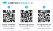

# CamperMinder Level — Anleitung

Diese Anleitung gehört zu jedem Gerät, auch zu den ersten Prototypen. Sie
bringt dich in einer Minute zum Nivellierungssystem auf dem Handy: **ohne App, ohne
Konto, ohne Koppeln.** Alles, was danach kommt, ist eine Erweiterung.

## In einer Minute zum Nivellierungssystem



Auf dem Gerät klebt dieser Aufkleber mit drei Codes. Du brauchst nichts zu
tippen: Für den ersten Start scannst du **Code 1 und dann Code 2**, Code 3
kommt erst später dazu, wenn das Gerät in deinem WLAN ist. Die
Codes hier in der Anleitung funktionieren genauso wie die auf dem Gerät.

**Womit scannen:** Mit der Kamera-App des Handys — die Kamera auf den Code
halten, bis ein Hinweis erscheint, und den antippen. Auf Android geht auch
Google Lens. Liest die Kamera nichts, ist in ihren Einstellungen das Scannen
von QR-Codes vielleicht abgeschaltet.

1. **Strom anschließen**, auf einem von zwei Wegen:
   - **USB-C**, 5 V: an eine USB-Steckdose im Fahrzeug, ein USB-Netzteil oder
     eine Powerbank.
   - **Schraubklemme**, 7 bis 36 V: **VIN** an Plus, **GND** an Minus der
     Aufbaubatterie, also 12 oder 24 V direkt aus dem Bordnetz. Falsch herum
     angeklemmt passiert nichts, es geht nur nichts.

   Beide dürfen auch gleichzeitig stecken, dann versorgt die stärkere Quelle.
   Die **grüne** Leuchte zeigt: Strom ist da. Nach wenigen Sekunden ist das
   Netz **CamperMinder** bereit.

2. **Code 1 scannen: Handy verbinden.** Das Handy fragt, ob es dem Netz
   **CamperMinder** beitreten soll: **Verbinden** bzw. **Beitreten**
   bestätigen. Das ist das eigene Netz des Geräts, nicht dein eigenes WLAN, etwa der Router im Fahrzeug —
   ein Passwort braucht es ab Werk nicht.

   Weil dieses Netz kein Internet hat, reagiert jedes Handy etwas anders:
   - **iPhone:** Oft öffnet sich die Bedienseite jetzt **von selbst**, in
     einem Fenster namens *Anmelden*. Dann bist du fertig und brauchst Code 2
     nicht. Wenn du das Fenster schließt, fragt das iPhone, wie es weitergehen
     soll: **Ohne Internet verwenden.** Öffnet sich nichts, weiter mit Code 2.
   - **Android:** Die Bedienseite öffnet sich meist **nicht** von selbst. Das
     Handy zeigt eventuell an, das Netz habe kein Internet, und fragt, ob es
     verbunden bleiben soll: **Ja** bzw. **Verbindung beibehalten.** Dann
     weiter mit Code 2.

3. **Code 2 scannen: Bedienseite öffnen.** Die Seite `192.168.4.1` öffnet
   sich im Browser, dein Nivellierungssystem ist bereit.

Mehr ist für den Betrieb nicht nötig. Das Gerät braucht kein Internet, und
du kannst die Seite jederzeit wieder so öffnen: im Netz CamperMinder Code 2
scannen.

### Ohne Aufkleber, oder wenn ein Code nicht geht

- **Statt Code 1:** In den WLAN-Einstellungen des Handys **CamperMinder**
  wählen. Ab Werk hat dieses Netz kein Passwort. Hast du unter *Technik →
  Eigenes Netz* ein eigenes vergeben, gilt deines — dann passt Code 1 nicht
  mehr, das Netz musst du von Hand wählen.
- **Statt Code 2:** Im Browser **`192.168.4.1`** eingeben. Manche Browser
  machen daraus eine Suche; dann vollständig `http://192.168.4.1` eingeben.
- **Abkürzung auf Samsung-Handys:** *Einstellungen → Verbindungen → WLAN*,
  beim verbundenen Netz **CamperMinder** auf das Zahnrad tippen, dann
  **Router verwalten**. Das öffnet ebenfalls `192.168.4.1`.

> **Ein Symbol wie eine App.** Die Seite dafür im richtigen Browser öffnen,
> nicht im Fenster *Anmelden* des iPhone: auf dem iPhone in Safari
> `192.168.4.1` aufrufen, dann *Teilen → Zum Home-Bildschirm*; auf Android in
> Chrome, dann *⋮ → Zum Startbildschirm hinzufügen*. Code 2 öffnet die Seite
> bereits im richtigen Browser. Das Symbol öffnet sie im Vollbild — wo ein
> Bluetooth-Gerät eine App braucht, steckt hier die Seite im Gerät selbst,
> und jedes Update bringt sie mit.

## Einbauen

- **Der Pfeil zeigt nach vorn.** Er steht auf der Gehäusewand und zeigt in
  Fahrtrichtung, USB-Buchse und Klemme liegen hinten. Um 90 Grad verdreht
  eingebaut verwechselt das Gerät längs und quer.
- **Deckel oben** ist der Normalfall. Wer das Gehäuse unter ein Regalbrett
  klebt, stellt unter *Anzeige → Gerät → Einbaulage* auf **Deckel unten**.
- **Fest und flach.** Auf eine ebene, feste Fläche schrauben oder kleben. Ein
  Gerät, das wackelt, misst das Wackeln.

## Einmal einrichten

1. *Anzeige → Fahrzeug*: Fahrzeugart, Radstand und Spurweite. Aus den Maßen
   rechnet das Gerät, wie viele Zentimeter jede Ecke hoch muss.
2. Das Fahrzeug einmal wirklich waagerecht stellen, mit einer Wasserwaage
   längs und quer geprüft, und auf *Anzeige* unter den Ansichten **Neigung
   kalibrieren** tippen. Ab Werk ist der Sensor bereits kalibriert; dieser
   Schritt gleicht aus, wie das Gerät in deinem Fahrzeug sitzt. Mehr dazu in
   [kalibrierung.md](kalibrierung.md).

## Was die Leuchten sagen

| Leuchte | Bedeutung |
|---|---|
| **grün**, an | Strom ist da |
| **rot**, lang an, lang aus | Das eigene Netz ist offen: Code 1, dann Code 2 — oder von Hand mit **CamperMinder** verbinden und `192.168.4.1` öffnen |
| **rot**, ein kurzes Blinken alle drei Sekunden | Das Gerät ist in deinem WLAN |
| **rot**, gleichmäßig im Halbsekundentakt | Der Sensor antwortet nicht. Bitte melden. |
| **rot**, hektisches Doppelblinken, dazu drei Töne | Wächteralarm: Das Fahrzeug hat seine Lage verändert |
| **rot** aus | Die Leuchte ist mit dem Schalter *Status-LED* abgeschaltet. Ein Alarm blinkt trotzdem. |

## Sprache

Die Bedienseite spricht **Deutsch und Englisch**. Ohne eigene Wahl richtet sie
sich nach der Spracheinstellung des Handys; umstellen unter Reiter **Technik**
→ **Sprache**.

Die Wahl gilt **je Handy**, nicht je Gerät — zwei Leute in einem Fahrzeug
lesen so jeder in seiner Sprache. Die Namen der Messwerte bleiben deutsch,
damit Home Assistant und MQTT bei einem Sprachwechsel weiter zusammenpassen.

## Ins eigene WLAN (Erweiterung)

Nur nötig für automatische Updates und Home Assistant. Ohne diesen Schritt
funktioniert alles andere unverändert, unterwegs sowieso.

1. Das Handy mit dem Netz **CamperMinder** verbinden (Code 1) und
   die Seite mit **Code 2** öffnen — Code 2 öffnet sie im richtigen Browser.
   **Nicht im Fenster *Anmelden*** des iPhone arbeiten: Das schließt sich,
   sobald das Handy das Netz wechselt, und dann kann die Seite das Gerät nicht
   mehr suchen. Dort *Technik → WLAN*, Name und Passwort deines WLANs
   eintragen, **Speichern und verbinden**.
2. **Auf der Seite bleiben.** Das Gerät startet neu und meldet sich in deinem
   WLAN an. Das Netz CamperMinder verschwindet, und dein Handy kehrt von
   selbst in dein WLAN zurück. Die Seite sucht das Gerät dann dort und zeigt
   nach meist unter einer Minute: **Gefunden: Das Gerät ist in deinem WLAN
   unter 192.168.178.45 erreichbar** (die Zahl ist bei dir eine andere).
3. **Im Heimnetz öffnen** tippen und dort das Symbol neu auf den
   Home-Bildschirm legen.

Damit hast du zwei Symbole, und beide bleiben richtig. Ist das Gerät in deinem
WLAN, gilt die neue Adresse. Ist dein WLAN nicht in Reichweite, öffnet das Gerät nach
etwa 20 Sekunden wieder sein eigenes Netz, und es gilt `192.168.4.1`. Die
Zugangsdaten bleiben gespeichert.

**Code 3 auf dem Aufkleber** öffnet das Gerät in deinem WLAN über seinen Namen,
`camperminder-level.local`, ganz gleich, welche Adresse dein Router ihm gibt.
Dein Handy muss dafür in deinem WLAN sein, nicht im Netz CamperMinder. Auf
dem iPhone klappt das, auf Android nicht auf jedem Gerät. Öffnet Code 3 dort
nichts, nimm das Symbol, das du dir in Schritt 3 angelegt hast.

Welcher Code wann:

| Du bist … | Code |
|---|---|
| beim ersten Start, oder dein WLAN ist nicht in Reichweite: das Gerät hat sein eigenes Netz offen | **1**, dann **2** |
| das Gerät ist in deinem WLAN | **3** |

**Kommt das Netz CamperMinder nach einer halben Minute wieder,** hat die
Anmeldung nicht geklappt, meist wegen eines Tippfehlers im Passwort. Die Seite
sagt das dann auch. Einfach wieder verbinden, berichtigen, speichern.

### Wenn die Seite das Gerät nicht findet

- **Im Router nachsehen.** In der Geräteliste deines Routers steht das Gerät
  unter seinem Namen, meist **camperminder-level**, bei der Fritzbox unter
  *Heimnetz → Netzwerk*. Die Adresse daneben im Browser aufrufen. Den genauen
  Namen nennt die Seite unter *Technik* als *Name im Netz*.
- **Code 3 scannen** oder `camperminder-level.local` im Browser eingeben. Auf
  dem iPhone klappt das fast immer, auf Android nicht auf jedem Gerät.
- **Beim nächsten Mal nachlesen.** Das Gerät merkt sich seine Adresse. Wenn du
  das nächste Mal im Netz CamperMinder bist, steht sie oben unter *Technik →
  WLAN*.

Die Suche findet nichts in Gäste-WLANs, die ihre Geräte voneinander
abschotten, und in ungewöhnlich eingerichteten Netzen. Dann bleibt der
Blick in den Router.

## Fernalarm einrichten (Erweiterung)

Der Wächter meldet eine Lageänderung an alle, die das Gerät erreichen — im
eigenen Netz. Wer am Strand steht, während das Fahrzeug aufgebockt wird,
erfährt es damit erst bei der Rückkehr. Genau dafür gibt es den Fernalarm:
Das Gerät schickt die Meldung selbst an einen Push-Dienst, den **du**
betreibst oder benutzt.

**Kein Konto bei uns, keine Daten bei uns, keine Verfügbarkeitszusage.** Das
ist der Preis dafür, dass es nichts kostet und niemand mitliest.

Reiter **Technik** → Abschnitt **Fernalarm**: Adresse eintragen, speichern,
**Testmeldung senden**. Der letzte Schritt gehört unbedingt dazu — ein
Alarmweg, den niemand ausprobiert hat, ist keiner.

### Was in das Feld gehört

Zwei Betriebsarten, unterschieden am Platzhalter `{text}`:

| | Adresse | Was das Gerät tut |
|---|---|---|
| **A** | ohne `{text}` | schickt die Meldung als Rumpf einer POST-Anfrage |
| **B** | mit `{text}` | setzt die Meldung kodiert in die Adresse ein und ruft sie ab |

### Dienste

| Dienst | Beispiel | Art | Kosten |
|---|---|---|---|
| **Telegram** | `https://api.telegram.org/bot<TOKEN>/sendMessage?chat_id=<Nr>&text={text}` | B | kostenlos |
| **Home Assistant Webhook** | `https://dein-ha/api/webhook/xyz` | A | kostenlos, wenn HA ohnehin läuft |
| **Node-RED, n8n, eigener Dienst** | Adresse des Ablaufs | A oder B | eigener Server |
| **ntfy selbst betrieben** | `https://ntfy.mein-server/mein-thema` | A | kostenlos, braucht einen Server |
| **ntfy.sh (gehostet)** | `https://ntfy.sh/mein-thema` | A | Grenzen im Gratisteil, Tarife darüber |
| **IFTTT Webhooks** | `https://maker.ifttt.com/trigger/<Ereignis>/with/key/<Schlüssel>?value1={text}` | B | Gratisteil begrenzt |

**Empfehlung für den Standardfall: Telegram.** Kein Server, kein Abo, kein
weiterer Dienst, den man kennenlernen muss — ein Bot bei @BotFather, und die
Meldung landet in einem Chat. Wer Home Assistant betreibt, nimmt besser den
Webhook: Dann entscheidet die Automatisierung, wohin die Meldung geht, und
kann auch Dienste bedienen, die das Gerät selbst nicht ansprechen kann.

**Pushover und Ähnliches gehen nicht direkt.** Sie verlangen eine POST-Anfrage
mit mehreren Formularfeldern; dafür passt keine der beiden Betriebsarten. Der
Weg dorthin führt über einen Webhook in Home Assistant oder Node-RED — der
nimmt die Meldung entgegen und schickt sie weiter, wohin er will.

### Telegram einrichten

Der empfohlene Weg für den Standardfall: kostenlos, kein Server, kein
weiterer Dienst.

**1. Bot anlegen.** In Telegram **@BotFather** anschreiben, `/newbot`,
Anzeigename eingeben (etwa `CamperMinder`), dann einen eindeutigen
Benutzernamen, der auf `bot` endet. BotFather antwortet mit dem **Token**:

```
8123456789:AAHxyz-abcDEF_ghiJKL1234567890mnop
```

**2. Den Chat starten.** Den eigenen Bot öffnen und **Start** drücken. Ein
Bot darf niemandem schreiben, der ihn nicht zuerst angeschrieben hat — ohne
diesen Schritt schlägt alles Weitere fehl.

**3. Chat-Nummer holen.** Im Browser aufrufen:

```
https://api.telegram.org/bot<TOKEN>/getUpdates
```

In der Antwort steht `"chat":{"id":123456789,...}` — diese Zahl ist die
Chat-Nummer. Kommt `{"ok":true,"result":[]}`, fehlt Schritt 2.

**4. Im Browser gegenprüfen**, bevor etwas ins Gerät getippt wird:

```
https://api.telegram.org/bot<TOKEN>/sendMessage?chat_id=<NUMMER>&text=Test
```

`{"ok":true,…}` und die Nachricht auf dem Handy heißt: passt. Bei `403`
fehlt Schritt 2, bei `401` stimmt der Token nicht.

**5. Ins Gerät eintragen** — dieselbe Adresse, statt `Test` der Platzhalter:

```
https://api.telegram.org/bot<TOKEN>/sendMessage?chat_id=<NUMMER>&text={text}
```

*Technik → Fernalarm*, eintragen, **speichern**, **Testmeldung senden**. Die
Adresse braucht rund 120 Zeichen, das Feld fasst 191.

### Wenn schon ein Bot vorhanden ist

Wer Telegram bereits mit Home Assistant oder einem anderen System benutzt,
braucht **keinen neuen Bot** — und muss nichts umstellen:

**Das Gerät schickt nur, es liest nie.** Es ruft ausschließlich `sendMessage`
auf. Mehrere Absender auf demselben Bot stören sich nicht. Ein bestehender
Webhook oder ein laufendes Abrufen durch Home Assistant bleibt unberührt.

- **Token:** steht in der Konfiguration des bestehenden Systems (bei Home
  Assistant unter `telegram_bot: api_key`). Sonst in Telegram bei
  **@BotFather** → `/mybots` → Bot auswählen → *API Token*.
- **Chat-Nummer:** ebenfalls aus der bestehenden Konfiguration (bei Home
  Assistant `allowed_chat_ids`).

> **`getUpdates` in diesem Fall nicht aufrufen.** Telegram lässt nur einen
> Abrufer gleichzeitig zu: Ist für den Bot ein Webhook gesetzt, antwortet
> `getUpdates` mit `409 Conflict`; ruft ein anderes System gerade ab, reisst
> man ihm die Meldung weg. Die Chat-Nummer kommt deshalb aus der vorhandenen
> Konfiguration — oder aus einem zweiten, eigenen Bot.

**Ein eigener Bot lohnt sich trotzdem**, wenn die Alarmmeldung anders klingen
oder in einem anderen Chat landen soll als der übrige Hausbetrieb. Beides
geht, es ist eine Frage des Geschmacks und nicht der Technik.

### Der Token ist ein Geheimnis

Wer sie hat, kann als dieser Bot schreiben. Sie steht im Gerät und ist auf
der Geräteseite lesbar — bei offenem eigenem Netz also für jeden in
Funkreichweite. **Wer den Fernalarm benutzt, vergibt unter *Technik → Eigenes
Netz* ein Passwort.** Und sie gehört auf kein Bildschirmfoto.

### Was der Fernalarm nicht kann

**Er braucht Internet am Fahrzeug.** Ohne eingetragenes WLAN mit Verbindung
nach draußen geht nichts hinaus — auf einem Stellplatz ohne Empfang bleibt
nur der Summer und die eingerastete Meldung im Gerät.

**Er weiß nicht, ob die Meldung ankommt.** Das Gerät erfährt vom Dienst nur,
ob dieser sie angenommen hat. Was danach passiert, liegt beim Dienst und bei
deinem Handy. Deshalb die Testmeldung.

**Eine Meldung je Alarm.** Der Alarm rastet im Gerät ein und bleibt stehen,
bis er quittiert wird — wiederholt verschickt wird er nicht.

## Software-Updates

| Lage | Weg |
|---|---|
| Gerät hat Internet | Reiter *Technik* → **Auf Updates prüfen** |
| Gerät im eigenen Netz | Reiter *Technik* → Firmwaredatei vom Handy aufspielen |

Die laufende Fassung steht im selben Reiter.

**Auf Updates prüfen** fragt bei GitHub nach und sagt dir, was es gefunden
hat:

- **„Du hast bereits die neueste Fassung (…)"** — nichts zu tun, das Gerät
  läuft einfach weiter.
- **„Neue Fassung … wird installiert"** — das Gerät lädt sie, spielt sie auf
  und startet neu. Danach **mindestens eine Minute am Strom lassen**, dann
  gilt die neue Fassung.
- **„Das Gerät hat gerade kein Internet"** — das Gerät ist nicht in einem WLAN
  mit Internet, etwa auf dem Stellplatz. Dann die Datei vom Handy aufspielen,
  siehe unten.
- **„GitHub war nicht zu erreichen"** — später noch einmal versuchen.

Aufgespielt wird nur eine **höhere** Fassung, nie eine ältere.

Drücken musst du dafür nicht: Hat das Gerät Internet, sieht es nach jedem
Einschalten und danach alle 12 Stunden selbst nach. Gibt es eine neue
Fassung, steht oben auf der Seite, auf jedem Reiter, ein blauer Hinweis
**„Neue Fassung … verfügbar. Zum Installieren hier tippen."** Installiert
wird erst, wenn du tippst und bestätigst — nie von allein, also auch nicht
während der Fahrt.

**Firmware vom Handy aufspielen:**

1. Aus dem Release auf GitHub die Datei **`level-firmware.ota.bin`** aufs
   Handy laden. **Nicht die `factory.bin`**: Die ist für ein leeres Board,
   als Update weist das Gerät sie ab.
2. *Technik → Software → Datei auswählen*, dann **Datei aufspielen**. Die
   Seite meldet „Übertragen. Das Gerät startet neu."
3. **Mindestens eine Minute am Strom lassen.** Erst dann gilt die neue Fassung
   als gut. Fällt der Strom vorher weg, kehrt das Gerät beim nächsten
   Einschalten zur alten Fassung zurück — mit Absicht, damit ein kaputtes
   Update es nicht lahmlegt.
4. Die Seite neu laden: Unter *Technik → Software* steht die neue Nummer.

> **Für die Werkstatt:** Aktualisierungen nur über OTA einspielen. Ein
> serielles Aufspielen mit Löschen des Flash nimmt dem Kunden sein
> eingerichtetes WLAN wieder weg — die gespeicherten Zugangsdaten liegen dort.

## Mit Home Assistant

Sobald das Gerät in deinem WLAN ist, findet Home Assistant es über
ESPHome von selbst. Die Integration **CamperMinder** kommt über HACS und bringt
die Bedienkarte mit; Firmware-Updates meldet Home Assistant dann automatisch.

### Meldungen aufs Handy: die Blueprints

Drei fertige Automatisierungen bringen die Meldungen des Geräts dorthin, wo du
sie liest. In Home Assistant: *Einstellungen → Automatisierungen & Szenen →
Blueprints → Blueprint importieren*, dann die Adresse einfügen:

- Kühlschrankwarnung:
  `https://github.com/rcdev67/camperminder/blob/main/blueprints/automation/camperminder/kuehlschrank_warnung.yaml`
- Wächteralarm:
  `https://github.com/rcdev67/camperminder/blob/main/blueprints/automation/camperminder/waechter_alarm.yaml`
- Frostwarnung:
  `https://github.com/rcdev67/camperminder/blob/main/blueprints/automation/camperminder/frostwarnung.yaml`

Danach *Automatisierung erstellen → Aus einem Blueprint*, das Gerät auswählen
und unter „Was soll passieren?" eintragen, wie du benachrichtigt werden willst.
Einzelheiten: [blueprints/README.md](../blueprints/README.md).

Beide Betriebsarten laufen auf derselben Firmware. Wer klein anfängt, kann
jederzeit umsteigen — ohne neue Software, ohne neues Gerät.

## Wenn etwas nicht klappt

| Was | Was hilft |
|---|---|
| Kein Netz **CamperMinder** in der Liste | Leuchtet die grüne Leuchte? Sonst fehlt Strom. Blinkt die rote kurz alle drei Sekunden, ist das Gerät in deinem WLAN, und das eigene Netz ist deshalb aus: siehe *Ins eigene WLAN*. Nach dem Einschalten bis zu 20 Sekunden warten. |
| Die Kamera reagiert nicht auf die Codes | In den Einstellungen der Kamera das Scannen von QR-Codes einschalten, oder Google Lens nehmen. Sonst die Wege unter *Ohne Aufkleber*. |
| Code 1 wird gelesen, aber das Handy tritt dem Netz nicht bei | Hat das eigene Netz ein Passwort bekommen (*Technik → Eigenes Netz*), passt Code 1 nicht mehr: Netz von Hand wählen und dein Passwort eingeben. |
| Nach Code 1 öffnet sich nichts | Auf Android normal: Code 2 scannen. Auf Samsung geht auch *WLAN → Zahnrad bei CamperMinder → Router verwalten*. |
| Code 2 öffnet nichts oder „Seite nicht erreichbar" | Das Handy ist nicht (mehr) im Netz CamperMinder. Erst Code 1, dann noch einmal Code 2. |
| Code 3 öffnet nichts | Code 3 gilt nur, wenn das Gerät in deinem WLAN ist und das Handy auch. Auf manchen Android-Handys geht `.local` gar nicht: dann das Symbol aus *Ins eigene WLAN*, Schritt 3, oder die Adresse aus dem Router. |
| Das Handy springt aus dem Netz CamperMinder zurück | Es sucht Internet und nimmt lieber dein WLAN. *Verbunden bleiben* bestätigen; hilft das nicht, bei deinem WLAN *Automatisch verbinden* kurz ausschalten oder die mobilen Daten. |
| `192.168.4.1` lädt nicht | Vollständig eingeben: `http://192.168.4.1`. Manche Browser machen sonst eine Suche daraus. Das Handy muss im Netz CamperMinder sein. |
| Längs und quer sind vertauscht | Das Gehäuse ist verdreht eingebaut. Der Pfeil muss nach vorn zeigen. |
| Die Blase springt bei der kleinsten Bewegung von Rand zu Rand | Kopfüber eingebaut, aber die *Einbaulage* steht auf *Deckel oben*. |
| Nach dem Eintragen des WLANs nicht mehr erreichbar | *Wenn die Seite das Gerät nicht findet*, oben. |
| Alles auf Anfang | *Technik → Zurücksetzen*. Löscht WLAN, Kalibrierung im Fahrzeug und Fahrzeugmaße; die Werkskalibrierung bleibt. |

## Für die Testerinnen und Tester der ersten Geräte

Du hast eines der ersten Geräte. Am meisten hilft uns, was **nicht** glatt
lief, und zwar so genau, wie du es noch weißt:

- **Dein Handy** mit Betriebssystem, etwa „iPhone 13, iOS 19" oder „Pixel 7,
  Android 15".
- **Die erste Minute**: Wie lange hat es vom Anschließen bis zur ersten
  Anzeige gedauert, und wo hast du gestockt?
- **Die Codes**: Hat sich nach Code 1 die Bedienseite **von selbst**
  geöffnet, oder brauchtest du Code 2? Hat das Handy etwas gemeldet, etwa
  „kein Internet" oder „anmelden"? Das unterscheidet sich von Handy zu Handy,
  und genau das wollen wir wissen.
- **Das eigene WLAN**: Hat die Seite das Gerät nach dem Eintragen gefunden?
  Welcher Router war es, etwa Fritzbox, Speedport oder ein Handy-Hotspot?
- **Jeder Satz auf der Seite, den du zweimal lesen musstest.**

Ein Bildschirmfoto sagt oft mehr als eine Beschreibung. Nur keines, auf dem
ein Telegram-Token zu sehen ist, siehe *Fernalarm*.
