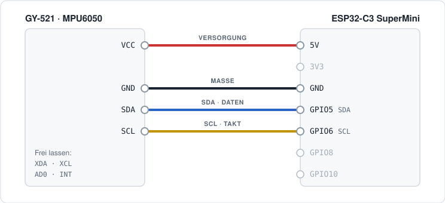
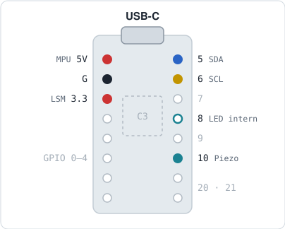

# Verkabelung

Alle Geräte hängen an **einem** I²C-Bus. Das OLED ist auf dem Board bereits fest
mit GPIO5/GPIO6 verbunden; der MPU6050 kommt einfach parallel dazu.

## MPU6050 (GY-521) → ESP32-C3-OLED-Board

| GY-521 | Board            | Hinweis                                   |
|--------|------------------|-------------------------------------------|
| VCC    | **5V** (falls vorhanden), sonst 3V3 | GY-521 hat eigenen 3,3-V-LDO |
| GND    | GND              | gemeinsame Masse — zwingend               |
| SDA    | **GPIO5**        | derselbe Pin wie das OLED                 |
| SCL    | **GPIO6**        | derselbe Pin wie das OLED                 |
| AD0    | offen lassen     | → Adresse 0x68                            |
| XDA / XCL / INT | offen lassen |                                       |

## MPU6050 (GY-521) → ESP32-C3 SuperMini

Dieselbe Belegung wie oben, nur ohne OLED auf dem Board. Die Firmware 3.9.1
bleibt unverändert: Sie benutzt ebenfalls GPIO5 und GPIO6.



Drahtfarben wie beim STEMMA-QT- bzw. Qwiic-Kabel: rot Versorgung, schwarz
Masse, blau SDA, gelb SCL. Liegt am 5V-Stift keine Spannung an, geht VCC auch
an 3V3 — der GY-521 hat einen eigenen Regler.

Die Firmware sucht weiterhin ein OLED an **0x3C**. Auf dem SuperMini fehlt es;
die Fehlermeldung dazu im Log ist erwartet und harmlos.



Die Skizze zeigt beide Sensorlinien. Für den MPU6050 gilt **5V**, der
Summer an GPIO10 und die LED an GPIO8 gehören zur Firmware 4.0.0 und bleiben
hier unbenutzt.

> **Vor dem Löten:** Die Stiftreihenfolge ist nicht bei jedem SuperMini-Nachbau
> gleich, und die Quellen sind sich bei den unbenutzten Stiften nicht einig.
> Gegen den Aufdruck auf der eigenen Platine prüfen — der Aufdruck gilt, nicht
> die Skizze.

## ESP32-C3 — freie/gesperrte Pins (wichtig!)

Der C3 ist **nicht** wie ein klassischer ESP32:

- **GPIO0/1** = 32-kHz-Quarz → für I²C unbrauchbar
- **GPIO2/8/9** = Strapping (Boot) · **GPIO11** = VDD_SPI · **GPIO12–17** = Flash
- **GPIO18/19** = USB · **GPIO20/21** = UART0 (Log)
- **frei nutzbar:** GPIO4, 5, 6, 7, 10

## Kontrolle per Log

Nach dem Flashen im ESPHome-Log auf den I²C-Scan achten:

```
Found device at address 0x3C   ← OLED
Found device at address 0x68   ← MPU6050
```

Fehlt **0x68**: SDA/SCL testweise tauschen, GND prüfen, Lötstellen am GY-521
kontrollieren. Eine andere Adresse als 0x68/0x69 ist **nie** der MPU6050.
